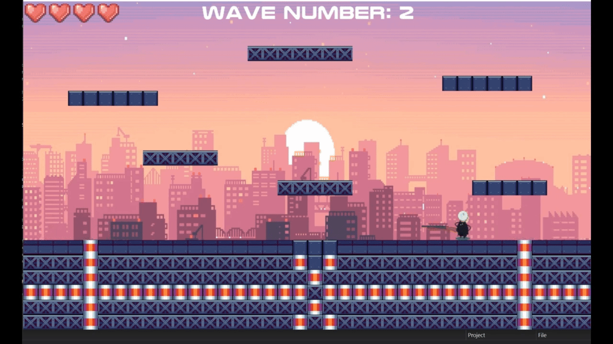

# Sci-Opolis

Sci-Opolis is a 2D wave survival shooter built in C# with MonoGame. Fight through increasingly crowded waves alone or with a second local player, earn coins, and buy permanent upgrades between runs. The game began as a Grade 12 programming project by Dan Lichtin.



*Historical gameplay recording included with the original repository; this is not a capture of the current build verification.* [Watch the original full gameplay video](https://youtu.be/HobAbvKmJ4E).

## Windows setup

### Prerequisites

| Requirement | Details |
| --- | --- |
| Windows 10 or 11, x64 | The build uses the legacy Windows MonoGame content compiler. A working graphics driver and audio output are needed to play. |
| Visual Studio 2022 or Build Tools 2022 | Install **.NET desktop development** in Visual Studio, or **.NET desktop build tools** in Build Tools. MSBuild 17 or newer is required. The build script finds it through `PATH` or the Visual Studio installer. |
| .NET Framework 4.8 or 4.8.1 runtime | The application still targets .NET Framework 4.6.1. Its compile-time reference assemblies restore through NuGet, so a separate 4.6.1 developer pack is unnecessary. |
| Visual C++ 2013 Redistributable, x64, 12.0.40664 | Install [Microsoft's x64 redistributable](https://aka.ms/highdpimfc2013x64enu). The content compiler needs its `VCOMP120.DLL` when importing images; newer Visual C++ redistributables do not replace this dependency. |
| Git and internet access | Git is needed to clone the repository. The first build downloads pinned packages from NuGet. |

Use a writable directory for the clone and game output. The game stores progress beside its executable.

No modern `dotnet` SDK, global MGCB installation, MonoGame editor extension, or system-wide font installation is needed. The build restores its own compiler, and the content sources include the fonts used by the game.

### Build and play

Run these commands in PowerShell:

```powershell
git clone https://github.com/DannyyyL/Sci-Opolis.git
cd Sci-Opolis
powershell -NoProfile -ExecutionPolicy Bypass -File .\build.ps1
```

The script restores packages, compiles the content and game, and checks that the executable, managed and native DLLs, compiled assets, and music sidecar files exist. It does not launch the game.

**Manual graphical step:** launch the Debug executable, then click **Single Player**:

```powershell
& '.\Sci-Opolis\bin\Debug\Sci-Opolis.exe'
```

Keep the entire output directory together if you copy the game elsewhere. Copying only the executable omits its DLLs and `Content` directory.

For an optimized build:

```powershell
powershell -NoProfile -ExecutionPolicy Bypass -File .\build.ps1 -Configuration Release
& '.\Sci-Opolis\bin\Release\Sci-Opolis.exe'
```

After a successful restore, use `-NoRestore` to build with the locally cached packages:

```powershell
powershell -NoProfile -ExecutionPolicy Bypass -File .\build.ps1 -NoRestore
```

You can also open `Sci-Opolis.sln` in Visual Studio 2022. Run the script first to check prerequisites and restore the exact package versions.

### Build dependencies

| Dependency | Version / source |
| --- | --- |
| MonoGame DesktopGL framework | `MonoGame.Framework.DesktopGL` **3.7.0.1708**, preserved from the original game |
| Content build targets | `MonoGame.Content.Builder` **3.7.0.9** |
| Windows content compiler | `MonoGame.Content.Builder.Windows` **3.7.0.8** |
| .NET Framework reference assemblies | `Microsoft.NETFramework.ReferenceAssemblies.net461` **1.0.3** |
| Animation and utility helpers | Checked-in `Libraries/Animation2D.dll` and `Libraries/Helper.dll` |

`Content/Content.mgcb` is the content manifest. MSBuild invokes the pinned local MGCB compiler to produce `.xnb` assets and music `.ogg` files, then copies the results into the game output. The MonoGame package supplies the SDL2 and OpenAL native libraries for both x86 and x64. Build output and restored packages are generated locally and excluded from Git.

For the original failure, project inventory, changes, and validation evidence, see [Windows build verification](docs/windows-verification.md).

## Controls

| Action | Keyboard / mouse | Controller |
| --- | --- | --- |
| Move left / right | **A / D** or **Left / Right Arrow** | Left stick or D-pad left / right |
| Jump | **Space** | **A** or D-pad up |
| Fire in the direction you face | Hold **P** | Hold right shoulder / **RB** |
| Select a menu option or weapon; buy an upgrade | Left click | Use the mouse |
| Reload | Automatic when the magazine empties | Automatic |
| Show / hide collision boxes | **1** | — |
| Quit immediately | **Escape**, or click **Exit** in the menu | Controller 1 **Back** |

Double jump becomes available after purchasing its upgrade. The game has no pause control, mouse aiming, or manual reload key.

For independent **Two Player** controls, use two controllers. Both players also receive the same keyboard input; player two's keyboard state handling makes its Space jump trigger on release. The mouse is still required for menus, and the selected weapon applies to both players.

## Gameplay

- **Endless waves:** each wave drops two groups of enemies. Groups grow as the wave number increases; clearing every enemy starts the next wave.
- **Three enemy types:** rifle-wielding LongLegs, Goop with periodic bursts of speed, and Cyclops that explodes near a player.
- **Two weapons:** start with the AK47 assault rifle and unlock a sawed-off shotgun that fires two projectiles per shot. Choose your weapon from the menu before starting a run.
- **Permanent upgrades:** spend coins on double jump, movement speed, firing/reload speed, an extra health point, and the shotgun unlock. Branches in the upgrade tree require their parent upgrade first.
- **Persistent statistics:** track best survival time, coins, coins spent, launches, total waves survived, and enemies killed.
- **Local co-op:** share the arena with a second player. The run ends when both players have died.
- **Presentation:** animated sprites, a tile-based arena, music for different screens, sound effects, and controller vibration while firing.

Run rewards are saved when all players die. Quitting during a run does not bank that run's coins or statistics. Upgrade purchases save immediately.

## Saves and default arena

On first launch, the game creates missing data files beside the executable from embedded defaults:

| File | Contents |
| --- | --- |
| `Stage.txt` | Three header lines followed by a 38-column × 22-row tile grid for the 1216×704 arena. |
| `Statistics.txt` | Six `label,value` rows: best survival time in total seconds, coins, coins spent, launches, waves survived, enemies killed. New profiles start at zero. |
| `Upgrades.txt` | Two header lines followed by five comma-separated flags. `1` means locked, `0` means unlocked; new profiles start with all five locked. |

Paths are resolved against the executable directory, so launching from another working directory uses the same saves. Debug and Release output directories have separate progress files. Rebuilding does not replace existing data files; deleting an output directory also removes the saves stored there.

Default creation never replaces an existing file, including a malformed one. The existing parsers do not automatically repair corrupt data. To reset progress, close the game, **back up** `Statistics.txt` and `Upgrades.txt`, then move those two files out of the executable directory and relaunch. Treat both files as a pair when restoring a profile. To reset the arena, back up and move `Stage.txt` separately. Startup recreates only the missing files.

The original `Stage.txt` was not committed. The supplied default arena was reconstructed from the historical GIF, so exact equivalence to the original layout is not guaranteed. Gameplay code, controls, enemy behavior, weapon timings, and upgrade costs were preserved by the build/runtime repair.

Best survival time is shown in seconds (`s`). New records use three decimal places and a decimal point in the save file regardless of Windows number settings. Shorter runs cannot lower a record, including after restarting. The old timer formatter lost minutes and misformatted some fractions; historical values are retained, but lost time cannot be recovered automatically.

## Architecture

| Component | Responsibility |
| --- | --- |
| `Program` → `Game1` | Starts the MonoGame loop. `Game1` coordinates menu, gameplay, upgrades, statistics, and game-over screens, content loading, and session progress. |
| `Player` | Movement, jumping, tile collision, health, and the held weapon. |
| `Gun`, `AK47`, `SawedOff`, `Bullet` | Weapon behavior, ammunition/reload timers, projectiles, and hits. |
| `Enemy`, `LongLegs`, `Goop`, `Cyclops` | Shared enemy behavior and the three specialized enemy types. |
| `WaveQueue`, `EnemyStack` | Queue scheduled groups and pop enemies into the arena. |
| `UpgradeTree`, `UpgradeNode` | Cost-ordered binary tree, upgrade prerequisites, drawing, and purchase interaction. |
| `FileManager`, `RuntimeData` | Read/write progress and tile data, locate saves, and create missing defaults. |
| `SFXManager` | Sound-effect playback. |

The project uses inheritance for enemies and guns, lists for active entities/projectiles, a 2D tile array, custom stack/queue classes for waves, and a binary tree for upgrades.

## Repository structure

```text
Sci-Opolis/
├── Sci-Opolis.sln
├── build.ps1                       # Restore, build, and output checks
├── NuGet.Config                    # Package source
├── README.md
├── docs/
│   └── windows-verification.md     # Inventory and validation evidence
├── tools/
│   ├── Verify-RuntimeData.ps1      # Data checks without a game window
│   ├── Verify-SurvivalTime.ps1     # Survival-record regression runner
│   └── SurvivalTimeChecks.cs      # Tests run in an isolated process
└── Sci-Opolis/
    ├── Sci-Opolis.csproj
    ├── packages.config            # Pinned dependencies
    ├── Program.cs / Game1.cs       # Entry point and game coordinator
    ├── Player.cs / Enemy.cs / LongLegs.cs / Goop.cs / Cyclops.cs
    ├── WaveQueue.cs / EnemyStack.cs
    ├── Gun.cs / AK47.cs / SawedOff.cs / Bullet.cs
    ├── UpgradeTree.cs / UpgradeNode.cs
    ├── FileManager.cs / RuntimeData.cs / SFXManager.cs
    ├── DefaultData/                # Embedded stage and new-profile data
    ├── Libraries/                  # Helper.dll and Animation2D.dll
    ├── Content/
    │   ├── Content.mgcb
    │   ├── Audio/                  # Music and sound sources
    │   ├── Fonts/                  # SpriteFont definitions and bundled font
    │   ├── Images/                 # Backgrounds, sprites, and tiles
    │   └── Sci-Opolis.gif          # Historical gameplay recording
    └── bin/Debug/ or bin/Release/  # Generated game output and local saves
```

## Verification and known limitations

Debug and Release builds and isolated data tests pass. A fresh clone of the runtime-fix commit also restores its packages and builds all 61 compiled assets without pre-existing build output. The Debug executable has been manually checked on Windows: the menu and audio work, and single-player movement, jumping, shooting, and platform collision work. Full co-op testing, upgrade purchases, and an end-to-end game-over/save/relaunch check remain manual verification steps. Build/output checks alone cannot verify graphics, sound, controller behavior, or gameplay; see the [verification record](docs/windows-verification.md) for the exact scope.

After building, run the isolated data checks without opening a game window:

```powershell
powershell -NoProfile -ExecutionPolicy Bypass -File .\tools\Verify-RuntimeData.ps1
powershell -NoProfile -ExecutionPolicy Bypass -File .\tools\Verify-SurvivalTime.ps1
```

This exercises default creation, parsing, save round trips, preservation of existing files, and working-directory independence using temporary test data. Pass `-Configuration Release` to check the Release build instead.

The survival-time regression checks exercise the game's record-saving method without opening a window, including runs over a minute/hour, shorter subsequent runs, fractional seconds, different number formats, and persistence across a new process. A visual check of the Stats menu still requires launching the game manually.

- The original .NET Framework 4.6.1 target and MonoGame 3.7 toolchain remain legacy dependencies. This repair does not migrate the project to a current framework. Linux and macOS builds are not configured or verified.
- The arena uses a fixed 1216×704 window and 32-pixel tiles; there is no resolution setting or in-game map editor.
- Multiplayer is local only. Keyboard input is shared, controller jumping uses held input, and menus require the mouse.
- There is no pause or mid-run resume. Progress files require a writable output directory, are plain text, and have limited validation.
- `Helper.dll` and `Animation2D.dll` are provided as binaries; their source projects are absent.
- The existing compiler warning `CS0649` for `Bullet.gameTime` remains. MGCB can also report a type-discovery warning on the first content build; all project assets still compile. Older and unused art assets are retained.
- The bundled OriginTech font is marked **personal use only** in its [included notice](Sci-Opolis/Content/Fonts/Readme.txt). The repository does not include an overall license granting reuse of all code and assets.
